# dedup-service

Request deduplication service for the Nginx API Gateway, written in Go.

Prevents duplicate HTTP requests from reaching upstream services by fingerprinting each request and storing the fingerprint in Redis with a configurable TTL. Duplicate requests within the window receive `409 Conflict`.

**No client-supplied idempotency key required. No client IP used.**

---

## How It Works

```
Client ──► Nginx ──► dedup-service ──► Redis SETNX
                         │                 │
              200 + X-Accel-Redirect   409 Conflict (dup)
             (not a duplicate)              │
                         │            returned to client
                         ▼
                  Upstream Backend
```

Nginx sends the full client request (method, URI, headers, body) to the dedup service via `proxy_pass`. The service fingerprints the request, checks Redis, and responds:

- **Allowed** → `200` with `X-Accel-Redirect` header → Nginx internally redirects to the upstream backend (HTTP method and body are preserved).
- **Duplicate** → `409 Conflict` with JSON body → returned directly to the client.

### Architecture Diagrams









### Fingerprint

```
SHA-256( Method | URI+Query | Body[:MaxBodyBytes] )
```

| Field | Notes |
|---|---|
| HTTP Method | POST vs PUT to same URI are distinct |
| URI + Query | Full request URI including query string |
| Body | First 64 KB (configurable via `dedup.max_body_bytes`) |

**Client IP and Authorization are intentionally excluded.** The fingerprint depends only on the request content itself — identical requests from different callers are considered duplicates.

---

## Project Structure

```
dedup-service/
├── cmd/server/main.go                  # Entrypoint (Gin router), wiring, graceful shutdown
├── config.json                         # Default config (loaded by Viper)
├── docs/                               # Architecture diagrams (SVG)
├── internal/
│   ├── config/
│   │   ├── config.go                   # Viper-based config from JSON with validation
│   │   └── config_test.go
│   ├── fingerprint/
│   │   ├── fingerprint.go              # SHA-256 fingerprint computation
│   │   └── fingerprint_test.go         # Determinism, per-field uniqueness, no-IP tests
│   ├── handler/
│   │   ├── health.go                   # /healthz handler + shared response payloads
│   │   ├── xaccel.go                   # X-Accel-Redirect handler (body-based dedup)
│   │   ├── xaccel_test.go              # X-Accel-Redirect handler tests
│   ├── metrics/
│   │   └── metrics.go                  # Prometheus counters and histograms
│   ├── middleware/
│   │   └── middleware.go               # Gin middleware: zerolog logging, recovery, metrics
│   └── store/
│       ├── store.go                    # Store interface, Redis impl, MemoryStore stub
│       ├── localcache.go               # Sharded L1 in-process cache (256 shards, FNV-1a)
│       ├── cached_store.go             # L1 → L2 (Redis) cache wrapper
│       └── store_test.go               # MemoryStore, LocalCache, CachedStore tests
├── nginx/dedup.conf                    # Nginx X-Accel-Redirect configuration
└── Makefile
```

---

## Quick Start

### Prerequisites

- Go 1.22+
- Redis 7+
- Nginx

### Run locally

```bash
# Start Redis
docker run -d -p 6379:6379 redis:7-alpine

# Build and run
make build
./bin/dedup-service

# Verify
curl http://localhost:8081/healthz
# {"status":"ok"}
```

### Run the test scripts

```bash
# Functional tests (17 cases)
bash scripts/functional_test.sh

# Load tests (healthz, dupes, unique)
bash scripts/load_test.sh

# Both in sequence
bash scripts/test_service.sh
```

> **Note:** The service and Redis must be running before executing the test scripts.

---

## Configuration

All configuration is loaded from `config.json` via [Viper](https://github.com/spf13/viper). If the file is absent, sensible defaults are used.

```bash
cp config.json config.json.bak   # backup before editing
```

```json
{
  "server": {
    "listen_addr": ":8081",
    "log_level": "info",
    "shutdown_timeout": "10s"
  },
  "log": {
    "file": "log/app.log",
    "max_size_mb": 50,
    "max_backups": 5,
    "max_age_days": 30,
    "compress": true
  },
  "redis": {
    "addr": "localhost:6379",
    "password": "",
    "db": 0,
    "dial_timeout": "500ms",
    "read_timeout": "200ms",
    "write_timeout": "200ms",
    "pool_size": 100,
    "min_idle": 20
  },
  "dedup": {
    "window": "10s",
    "max_body_bytes": 65536,
    "fail_open": true,
    "exclude_methods": ["GET", "HEAD", "OPTIONS"]
  },
  "performance": {
    "local_cache": true,
    "gogc": 200,
    "store_timeout": "500ms"
  }
}
```

| Key | Default | Description |
|---|---|---|
| `server.listen_addr` | `:8081` | HTTP bind address |
| `server.log_level` | `info` | `debug` \| `info` \| `warn` \| `error` |
| `server.shutdown_timeout` | `10s` | Graceful drain period on SIGTERM |
| `log.file` | `log/app.log` | Log file path |
| `log.max_size_mb` | `50` | Max size in MB before rotation |
| `log.max_backups` | `5` | Max old log files to keep |
| `log.max_age_days` | `30` | Max days to retain old log files |
| `log.compress` | `true` | Gzip rotated files |
| `redis.addr` | `localhost:6379` | Redis address |
| `redis.password` | _(empty)_ | Redis auth password |
| `redis.db` | `0` | Redis logical DB |
| `redis.dial_timeout` | `500ms` | TCP connection timeout |
| `redis.read_timeout` | `200ms` | Socket read timeout |
| `redis.write_timeout` | `200ms` | Socket write timeout |
| `redis.pool_size` | `100` | Connection pool size |
| `redis.min_idle` | `20` | Minimum idle connections |
| `dedup.window` | `10s` | Dedup window (Redis TTL) |
| `dedup.max_body_bytes` | `65536` | Max body bytes hashed (64 KB) |
| `dedup.fail_open` | `true` | Allow requests if Redis is down |
| `dedup.exclude_methods` | `["GET","HEAD","OPTIONS"]` | Methods that bypass dedup |
| `proxy.x_accel_redirect_prefix` | `/internal/upstream` | Nginx internal location prefix used for X-Accel-Redirect forwarding. |
| `performance.local_cache` | `true` | L1 in-process cache for duplicates |
| `performance.gogc` | `0` (Go default) | Go GC target percentage |
| `performance.store_timeout` | `500ms` | Context deadline for Redis calls |

### Dedup Window Sizing

| Use Case | Recommended Window |
|---|---|
| Payment / financial mutations | 10 – 30 s |
| General API mutations (POST/PUT) | 5 – 15 s |
| Low-latency idempotent writes | 2 – 5 s |
| Long-running job submission | 60 – 300 s |

---

## Nginx Setup

```bash
sudo cp nginx/dedup.conf /etc/nginx/conf.d/dedup.conf
sudo nginx -t && sudo nginx -s reload
```

Run the dedup service (X-Accel-Redirect mode is always enabled):

```bash
./bin/dedup-service
```

How it works:

1. Nginx sends every request (with body) to the dedup service via `proxy_pass`.
2. The service returns `200` with `X-Accel-Redirect: /internal/upstream{URI}` for allowed requests, or `409` for duplicates.
3. Nginx internally redirects allowed requests to the `/internal/upstream` location, which proxies to the real backend.
4. The original HTTP method and request body are preserved across the internal redirect.

### Operating Mode

The service runs in X-Accel-Redirect mode only:

| Mode | Config | Body in fingerprint? | Who forwards to upstream? |
|---|---|---|---|
| **X-Accel-Redirect** | `proxy.x_accel_redirect_prefix` | Yes | Nginx |

---

## Unauthenticated Routes

Without `Authorization`, the fingerprint has no per-caller scope. Two different anonymous users posting the same body to the same endpoint will collide and one will receive 409.

Options:

**1. Exclude the route entirely (simplest):**
```nginx
location /api/public/ {
    proxy_pass http://backend_service;  # no dedup
}
```

**2. Include a caller/resource discriminator in the request payload** (for example tenant ID or account ID) so fingerprints differ intentionally.

**3. Accept global scope** — appropriate if the route is naturally idempotent or the body is always unique.

---

## API

| Endpoint | Method | Called by | Normal response |
|---|---|---|---|
| `/*` (catch-all) | Any | Nginx `proxy_pass` (X-Accel mode) | `200` + `X-Accel-Redirect` (allow) or `409` (duplicate) |
| `/healthz` | `GET` | Load balancer / K8s probe | `200` (Redis reachable) or `503` |
| `/metrics` | `GET` | Prometheus scraper | Prometheus text exposition format |

### Prometheus Metrics

| Metric | Type | Labels | Description |
|---|---|---|---|
| `dedup_http_requests_total` | Counter | `method`, `path`, `status` | Total HTTP requests processed |
| `dedup_http_request_duration_seconds` | Histogram | `method`, `path` | Request latency in seconds |
| `dedup_checks_total` | Counter | `outcome` (`allowed`, `duplicate`, `error`, `excluded`) | Dedup check outcomes |
| `dedup_store_latency_seconds` | Histogram | `operation` | Store (Redis) operation latency |
| `dedup_cache_hits_total` | Counter | — | L1 cache hits (Redis round-trip avoided) |
| `dedup_cache_misses_total` | Counter | — | L1 cache misses (fell through to Redis) |

---

## Performance

### Architecture

The service uses a two-tier deduplication architecture:

```
Request → SHA-256 fingerprint → L1 cache (in-process) → L2 Redis (SETNX)
```

- **L1 cache**: 256-shard FNV-1a hash map with RWMutex per shard. Known duplicates are resolved in ~100ns without any Redis call.
- **L2 Redis**: Source of truth via atomic SETNX. Only L1 misses touch Redis.
- **GOGC tuning**: Set to 200 (vs default 100) to reduce GC pause frequency at the cost of higher memory.
- **automaxprocs**: Automatically sets GOMAXPROCS to match container CPU quota.
- **Connection pool**: 100 connections (20 idle) with 200ms read/write timeouts.

### Request Correlation

Every request gets an `X-Request-ID` header. If the client provides one, it is preserved; otherwise a random 32-character hex ID is generated. The ID appears in response headers and structured log entries.

### Observability

- **GET /healthz** — returns `{"status":"ok","cache_size":N}` with L1 cache entry count
- **GET /metrics** — Prometheus endpoint with HFT-tuned sub-millisecond histogram buckets
- **GET /debug/pprof/** — runtime CPU, memory, goroutine profiling

### Grafana & Prometheus Monitoring

```bash
make monitoring-up      # start Prometheus (localhost:9090) + Grafana (localhost:3000)
make monitoring-down    # stop and remove containers
```

Grafana ships with a pre-provisioned **Dedup Service** dashboard containing:

| Row | Panels |
|---|---|
| **Overview** | Request Rate (rps by path), Request Latency (p50/p95/p99) |
| **Deduplication** | Dedup Outcomes (allowed/duplicate/error/excluded), Duplicate Rate gauge, L1 Cache Hit Rate gauge |
| **Redis / Store** | Store Latency (p50/p95/p99), L1 Cache Hits vs Misses |
| **HTTP Status Codes** | Status Code Distribution, Error Rate (5xx) |
| **Latency by Endpoint** | /api/* Latency, /healthz Latency |

Default credentials: `admin` / `admin`

---

## Testing

```bash
make test          # all tests with race detector
make test-cover    # with coverage summary
```

Test coverage includes:

- Fingerprint determinism and per-field uniqueness (including explicit no-IP test)
- Handler allow / reject / fail-open / fail-closed / window expiry (Gin-based)
- Confirmation that client IP does not affect deduplication
- Global-scope collision on unauthenticated requests
- Session header as secondary differentiator
- MemoryStore concurrent access (exactly one allowed under fan-out)
- Config validation and JSON overrides via Viper

---

## Knowledge (From KNOWLEDGE.md)

### 1. Scope

This repository supports one runtime mode only:

- X-Accel-Redirect mode

Legacy reverse-proxy and sidecar/auth-request modes have been removed from runtime code.

### 2. High-Level Flow

1. Nginx forwards full client request (method + URI + body) to dedup service.
2. Dedup service computes fingerprint and checks Redis via atomic NX write.
3. If allowed, service returns `200` with `X-Accel-Redirect`.
4. Nginx internally redirects to upstream backend, preserving method and body.
5. If duplicate, service returns `409` with JSON error.

### 3. Fingerprint

Formula:

```
SHA-256( Method | URI+Query | Body[:max_body_bytes] )
```

Included:

- Method
- URI + query
- Body (up to configured byte limit)

Excluded by design:

- Client IP
- Authorization header
- Other headers

### 4. Store and Caching

- L2 source of truth: Redis using atomic SET NX with TTL (`dedup.window`).
- L1 local cache: in-process sharded cache to short-circuit known duplicates.

Behavior:

- First request for key: allowed and stored with TTL.
- Repeated request within window: duplicate (`409`).

### 5. Endpoints

- `ANY /*`: catch-all dedup handler (primary request path)
- `GET /healthz`: readiness/liveness
- `GET /metrics`: Prometheus metrics
- `GET /debug/pprof/*`: profiling endpoints

### 6. Responses

Allowed request:

- `200 OK`
- `X-Accel-Redirect: /internal/upstream{request_uri}`

Duplicate request:

- `409 Conflict`
- Body:

```json
{
  "error": "duplicate_request",
  "details": "an identical request was received within the deduplication window"
}
```

Store unavailable (fail-closed):

- `500 Internal Server Error`

Health failure:

- `503 Service Unavailable`

### 7. Configuration

Config is loaded from JSON files (`config.json`, `config.docker.json`).

Important keys:

- `dedup.window`
- `dedup.max_body_bytes`
- `dedup.fail_open`
- `dedup.exclude_methods`
- `proxy.x_accel_redirect_prefix`
- `performance.local_cache`
- `performance.store_timeout`

`proxy.x_accel_redirect_prefix` is required and defaults to `/internal/upstream`.

### 8. Nginx Contract

Required Nginx behavior:

- Forward full request body to dedup service (`proxy_pass` defaults are sufficient).
- Keep original request method before redirect.
- In internal upstream location, restore original method with `proxy_method`.
- Use `internal` location for redirect target prefix.

### 9. Observability

Primary metrics:

- `dedup_http_requests_total`
- `dedup_http_request_duration_seconds`
- `dedup_checks_total` (`allowed`, `duplicate`, `error`, `excluded`)
- `dedup_store_latency_seconds`
- `dedup_cache_hits_total`
- `dedup_cache_misses_total`

### 10. Testing

Recommended commands:

```bash
go test ./...
bash scripts/functional_test.sh
bash scripts/load_test.sh
```

Functional/load scripts are aligned to X-Accel-only behavior and use generic API paths (for example `/api/orders`).
